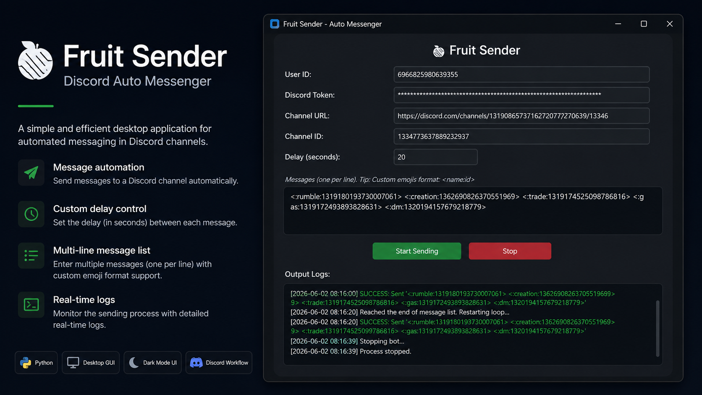

# Fruit Sender - Self Account Booting Auto Messenger (not Use Any Bot)

<p align="center">
  
</p>

Welcome to **Fruit Sender**, a lightweight desktop application with a Graphical User Interface (GUI) to automate sending messages in Discord. This system allows you to manage preset messages and configure precise delivery intervals directly through a clean, intuitive interface.

> **Note:** This software is **100% Free and open source**.

---

## Features

- **Graphical User Interface (GUI):** Manage configurations, message queues, and execution without relying on command-line prompts.
- **In-App Message Management:** Input and manage your messages directly in the application. Supports custom Discord emojis (format: `<:emoji_name:emoji_id>`).
- **Secure Configuration:** Safely stores your User ID, Token, and channel information locally using a hidden `.env` file.
- **Real-Time Logging:** Monitor success rates, failures, and connection statuses in real-time within the app, complete with color-coded alerts.
- **Graceful Execution:** Non-blocking operations allow you to stop or start the messaging process at any time without freezing the window.

---

## Prerequisites

Before using this application, you must have **Python** installed on your system. 
If you do not have Python installed, please download and install the latest version from the [Official Python Website](https://www.python.org/downloads/).

---

## Installation Guide

### Step 1: Clone or Download
Ensure you have the project files extracted in your desired directory.
Or Download The [.exe](https://github.com/muhammadzidane632/FruitSender/releases/download/v1.0.0/FruitSender.exe) File

### Step 2: Setup Virtual Environment
It is highly recommended to run this project within a Python virtual environment to avoid dependency conflicts. Open your terminal in the project directory and execute:

**Windows:**
```cmd
python -m venv .venv
.\.venv\Scripts\activate
```

**Mac/Linux:**
```bash
python3 -m venv .venv
source .venv/bin/activate
```

### Step 3: Install Dependencies
Install the required packages using the securely provided `requirements.txt`:

```cmd
pip install -r requirements.txt
```

---

## How to Use

Execute the following command to launch the application:

```cmd
python main.py
```

1. **Configure Credentials:** Enter your User ID, Discord Token, Channel URL, Channel ID, and preferred Delay (in seconds).
2. **Draft Messages:** Use the Messages text area to input the content you wish to send. Provide one message per line.
3. **Execute:** Click **Start Sending**.
4. **Save State:** The application automatically saves your credentials and messages, so they will be pre-loaded the next time you open the program.
5. **Halt Execution:** Click **Stop** at any point to terminate the automated messaging sequence safely.

---

## How to Find Custom Emote IDs

If you want to use custom emojis in your automated messages, you must use the proper format `<:emote_name:emote_id>`. Here is how you can easily find it:

1. **Send the custom emoji** normally in any Discord server chat.
2. **Right-click** on the message you just sent containing the emoji.
3. Select **"Copy Text"** from the context menu (or select and copy normally).
4. **Paste** the copied text directly into the "Messages" area in Fruit Sender. It will automatically be formatted perfectly with both the emote name and ID.

---

## How to Get Your Discord Token

If you are unsure how to retrieve your Discord token, please refer to the following video tutorials based on your device.  
*(**Note:** Focus strictly on the steps demonstrating how to extract the Discord Token from the videos.)*

- **Desktop:** [Watch Video](https://youtu.be/GUqSNoJ28aU?si=CUjnt2NPDbkcwq52)
- **Android** *(Lemur Browser required):* [Watch Video](https://youtu.be/ER0wbBBf65c?si=b_UaQI8WmudYqDKx)
- **iOS:** [Watch Video](https://youtu.be/12izuo2gie0?si=vheP-ReYf3W1cN0V)

---

## Disclaimer

> Automating a standard user account ("Self-Botting") is a violation of Discord's Terms of Service. The developer assumes no responsibility for any account suspensions or bans that may result from the use of this software. **Use it responsibly and at your own risk.**

